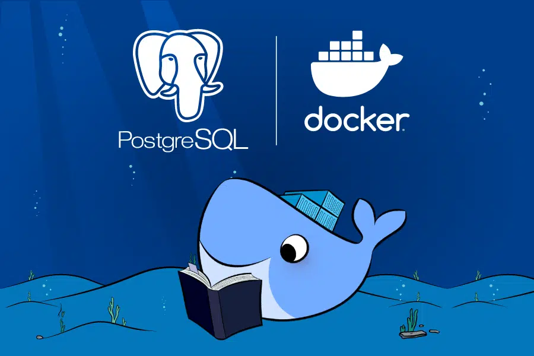

# distributed-systems_Golang
Just a crud in Golang using Rest and gRPC to communicate with database and process with Architecture based on Microservices.

## REST API

#### Setup application 

    * Clone this repos
    * Ensure Docker is running correctly on your machine
    * Install Docker Compose if you don´t have it
    * In the aplication local path run:
    

~~~shell
    docker-compose up
~~~

[Application listening on](http://localhost:5000) - http://localhost:5000

1. Create 

    Route - **/createUser** \
    HTTP Method - POST

    **Request body**

    ~~~json
    {
        "name": "exemple",
        "password": "passwordEncryptExample",
        "email": "email@exemple.com",
        "address": "addressExemple"
    }
    ~~~

2. Read 

    Route - **/getUserId/{id}** \
    HTTP Method - GET \
    Path Variable - 